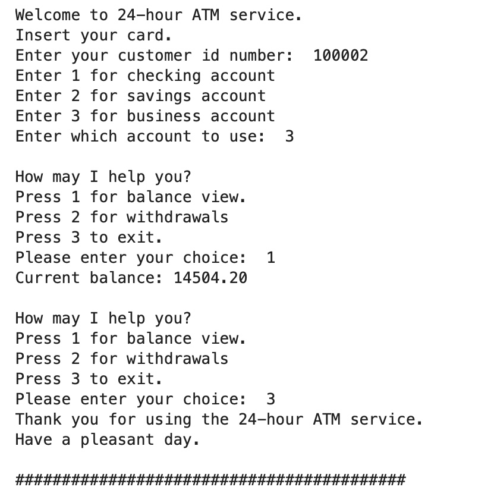

# Bank_Ac_Manager

### [Project_2:Bank_Ac_Manager]() (Link to project)

*This is a Python application that uses an abstract class to represent various bank account types and is structured like an ATM. Every type of account will implement different methods for managing credits and debits and inherit from the Account abstract class.

**Outcome**:

